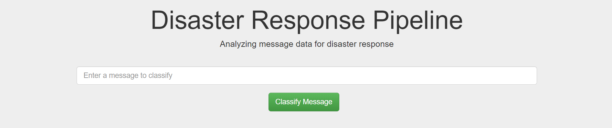

# Disaster Response Pipeline Project

## Description

Responding to diasters is an important task that needs to be quick and efficient. During a disaster, thousands of texts or messages flood the social media or any other news media that need to be paid attention. Based on the necessity in the message, it is forwarded to the relevant department and aid operations are carried out. During disasters, responsive teams are usually vunerable and simple key word mapping to classify a message might miss hidden nuances but should also be robust enough to makse sure it's aid related. A deployed machine learning model that has the capability to automatically classify the incoming messages is what this project is about.

There are 3 major componenets in this project
1. An ETL pipeline that extracts the data, cleans it and loads it into a postgres database.
2. A ML/NLP pipeline that loads the data from the database, performs training and optimizing operations to generate a model.
3. A web app, that takes new incoming messages, feed them to the trained model, predict the category of the message and display it on the UI.

## Dependencies

* ORM - SqlAlchemy
* Language - Python 3.7.9
* ML - Sklearn, Numpy, Pandas
* NLP - NLTK (wordnet, punkt, stopwords, average_perceptron_tagger)
* Web app - Flask
* Visualizations - Plotly

## Contents

* <code>data/process_data.py</code> File that takes in data, sends it through ETL pipeline and stores in database
* <code>models/train_classifier.py</code> File that loads data from database, trains and stores the ML model into a pickle file.
* <code>data/disaster_messages.csv</code> and <code>data/disaster_categories.csv</code> Data used to train the model, provided by [FigureEight](https://appen.com/)
* <code>run.py</code> Flask web app
* <code>templates/master.html</code> Main Html file and <code>templates/go.html</code> Html file that displays fetched results
    
## Instructions:
1. Clone the repository by executing <code>git clone https://github.com/siddarthaThentu/Disaster-Response-Pipeline.git<code>

2. Run the following commands in the project's root directory to set up your database and model.

    - To run ETL pipeline that cleans data and stores in database
        `python data/process_data.py data/disaster_messages.csv data/disaster_categories.csv data/DisasterResponse.db`
    - To run ML pipeline that trains classifier and saves
        `python models/train_classifier.py data/DisasterResponse.db models/classifier.pkl`

3. Run the following command in the app's directory to run your web app.
    `python run.py`

3. Go to http://0.0.0.0:3001/
